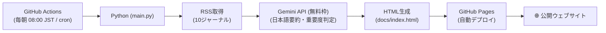

# 🧬 CMC News Daily

バイオ医薬品・製剤（CMC）分野の最新論文を自動で収集・要約し、**GitHub Pages で毎日公開**する静的ウェブサイト生成システムです。  
**GitHub Actions**、**Python**、**Gemini API（無料枠）** を組み合わせ、**完全無料・サーバー不要**で運用できます。

---

## 🌐 公開サイト

**`https://<your-github-username>.github.io/CMCNews/`**

毎朝 8:00（日本時間）に自動更新されます。

---

## 📱 サイトイメージ

毎日、以下のような論文ダイジェストページが生成・公開されます：

> **🧬 CMC News Daily — 2026/09/23 (Wed) ／ 20件**
>
> 💊 **[製剤・DDS]** ポリソルベート80の分解がmAb製剤の凝集に与える影響  
> 原題: Impact of Polysorbate 80 Degradation on mAb Aggregation ...  
> • PS80の酸化分解産物がmAb凝集挙動に与える影響をSEC-MALSで評価  
> • 酸化度5%超過で凝集速度が有意増加（p<0.01）、40℃加速試験で顕著  
> • 抗酸化剤（メチオニン）の併用と含量モニタリング強化を推奨  
> *JPharmSci ｜ 原文を読む →*

---

## 🛠️ システム構成



- **費用**: 完全無料（クレジットカード登録不要）
- **AI**: Gemini 2.5 Flash（1日1,500リクエストまで無料）
- **実行環境**: GitHub Actions（パブリックは無制限）
- **ホスティング**: GitHub Pages（無料・独自ドメイン対応）

---

### 📡 収集対象ジャーナル（10誌）

| 分類 | ジャーナル | 出版社 |
| :--- | :--- | :--- |
| **製剤・物性解析** | Journal of Pharmaceutical Sciences (JPharmSci) | Elsevier |
| **製剤・DDS** | Journal of Controlled Release (JCR) | Elsevier |
| **製剤・DDS** | Advanced Drug Delivery Reviews (ADDR) | Elsevier |
| **製剤・物性解析** | European Journal of Pharmaceutics and Biopharmaceutics (EJPB) | Elsevier |
| **製剤・物性解析** | International Journal of Pharmaceutics (IJP) | Elsevier |
| **製剤・物性解析** | Molecular Pharmaceutics | ACS |
| **物性・分析** | Analytical Chemistry | ACS |
| **抗体・バイオプロセス** | mAbs | Taylor & Francis |
| **抗体・バイオプロセス** | Biotechnology and Bioengineering (B&B) | Wiley |
| **抗体・バイオプロセス** | Journal of Bioscience and Bioengineering (JBB) | Elsevier |

---

## 🚀 セットアップ手順（約10分）

### ステップ 1: 無料の Gemini API キーを取得する

1. [Google AI Studio](https://aistudio.google.com/) にアクセスし、Googleアカウントでログインします。
2. **「Get API key」** → **「Create API key」** をクリックして生成します（クレジットカード不要）。

---

### ステップ 2: GitHub リポジトリの作成と Secrets 登録

1. GitHubで **Public** リポジトリを作成し、このプロジェクトをpushします。
2. リポジトリの **「Settings」** → **「Secrets and variables」** → **「Actions」** を開きます。
3. **「New repository secret」** で以下を登録します：

| Secret名 | 設定する値 |
| :--- | :--- |
| `GEMINI_API_KEY` | ステップ1で取得した Gemini APIキー |

---

### ステップ 3: GitHub Pages の設定

1. リポジトリの **「Settings」** → **「Pages」** を開きます。
2. **「Source」** を **「Deploy from a branch」** に設定します。
3. Branch を **`gh-pages`** / **`/(root)`** に設定して **「Save」** をクリックします。

> **Note**: `gh-pages` ブランチはGitHub Actionsの初回実行後に自動作成されます。

---

### ステップ 4: 動作テスト（手動実行）

1. **「Actions」** タブを開きます。
2. **「CMC News Site Builder」** を選択します。
3. **「Run workflow」** → **「Run workflow」** をクリックします。
4. 完了後、`https://<your-username>.github.io/CMCNews/` にサイトが公開されます。

---

## 💻 ローカル環境でのテスト実行

### 1. 依存ライブラリのインストール

```bash
pip install -r requirements.txt
```

### 2. 環境変数の設定

```bash
cp .env.example .env
# .env を開いて GEMINI_API_KEY を設定
```

### 3. テストコマンド

```bash
# ① RSS取得のみテスト（APIキー不要・HTML生成なし）
python main.py --dry-run

# ② HTMLサイト生成テスト（ダミーデータ使用）
python main.py --test-site
# → docs/index.html が生成されます。ブラウザで確認してください。

# ③ 本番実行（RSS取得 → Gemini要約 → HTML生成）
python main.py
```

---

## ⚙️ カスタマイズ設定

### 配信時刻を変更したい

`.github/workflows/daily_ai_news.yml` の `cron` を編集します（UTC基準）。

- **朝 7:00 (JST)**: `cron: '0 22 * * *'`
- **朝 8:00 (JST) [デフォルト]**: `cron: '0 23 * * *'`
- **朝 9:00 (JST)**: `cron: '0 0 * * *'`

### ジャーナルを追加・変更したい

[src/config.py](src/config.py) 内の `RSS_FEEDS` リストにフィードを追加・編集できます。

```python
RSS_FEEDS = [
    {
        "name": "ジャーナル名",
        "url": "https://example.com/rss",
        "category": "製剤・DDS",  # カテゴリバッジの色が変わります
    },
    ...
]
```

### 表示件数を変えたい

`MAX_ARTICLES`（デフォルト: `20`）を環境変数またはGitHub Actionsのワークフローで変更できます。
